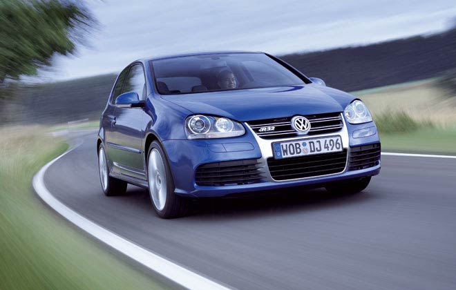

# Filtering and Hybrid Images

This essentially aims to implement a poor man's implementation of hybrid images. A true implementation requires the Fast Fourier Transform (FFT) for frequency filtering.

Instead, we use Gaussian blurring, Sobel edge detection, and the Laplacian of the Gaussian (LoG), also known as the 2nd derivative of the Gaussian).

## Here are some of the results:

    
    
    

    
    
    

    
    
    

