# Thresholding and Regions

The goal of this project was to "detect" a computer screen. This same process can be used to detect a myriad of items.

First, thresholding was performed by using Otsu's method. This seperates every pixel in an image into two classes, a foreground and a background. Then, median filtering and morphology were used. Median filtering is a technique that reduces noise, and morphology applies a structuring element to an input image. I got the best results by applying erosion followed by dilation, and then dilation followed by erosion. Connected components were then used to remove any erraneous blobs that were of no use. Finally, the draw_contours() method was used to display regions as a rotated rectangular bounding box (because we are trying to detect screens). 

# Example of the Process

    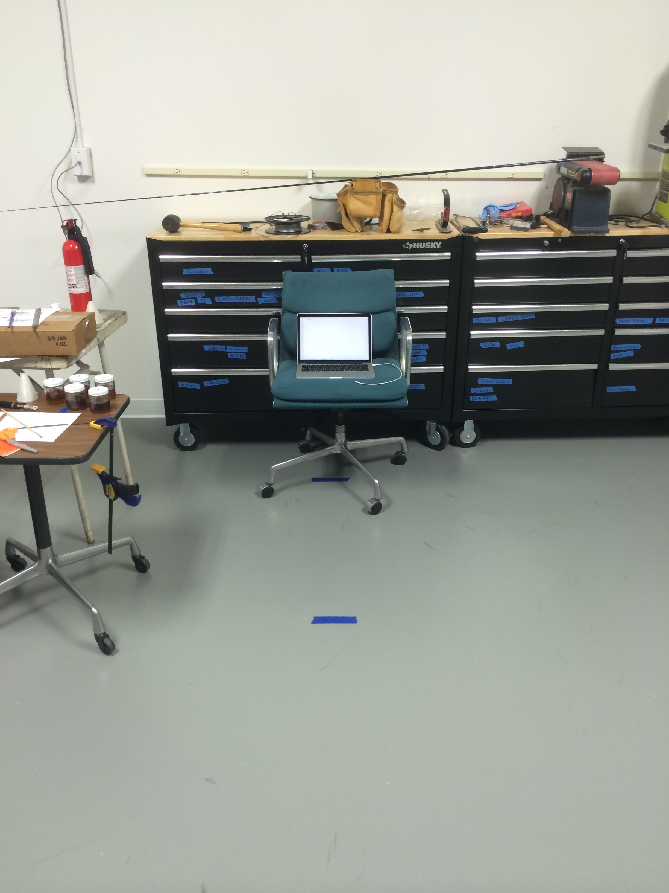
    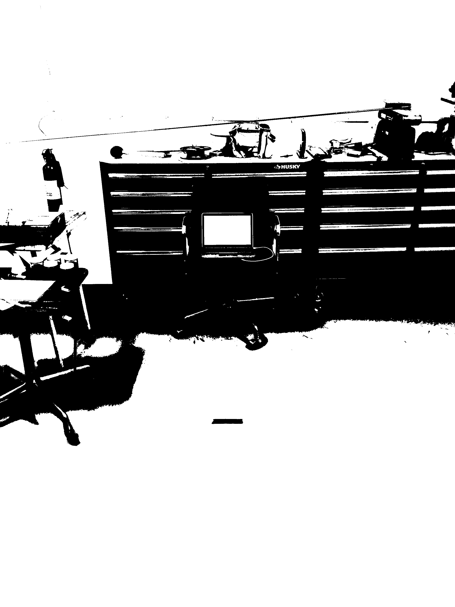
    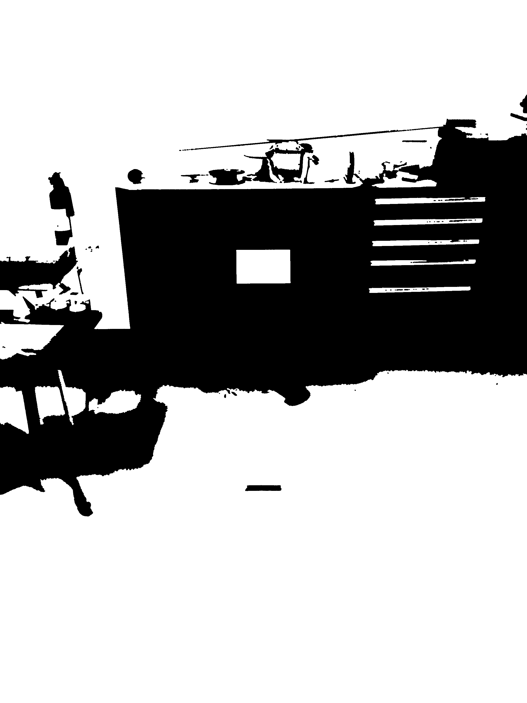
    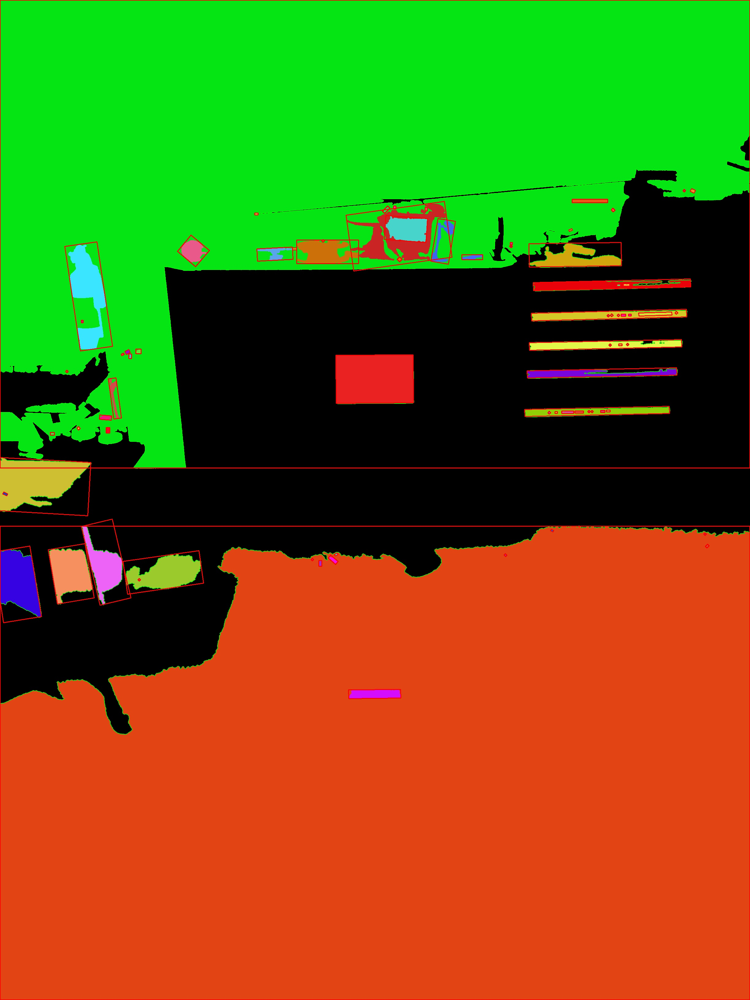
    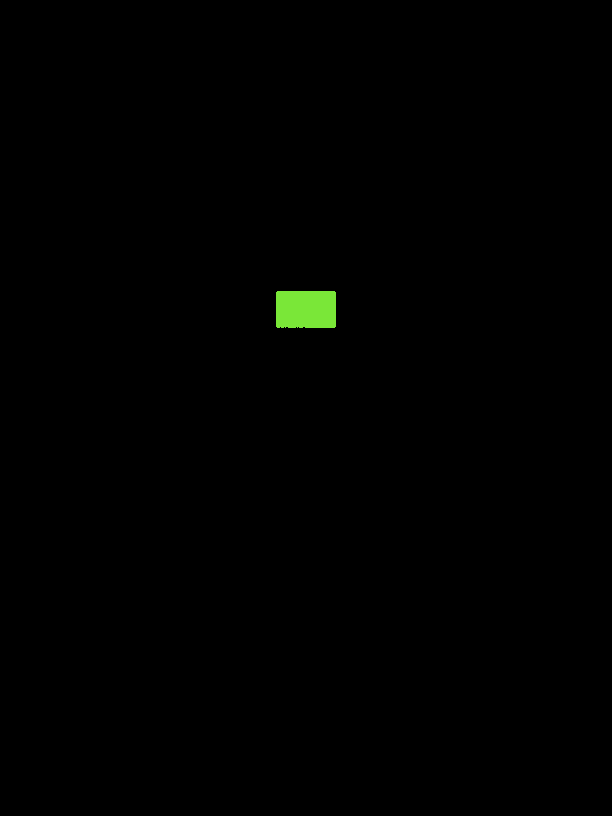

# Results

    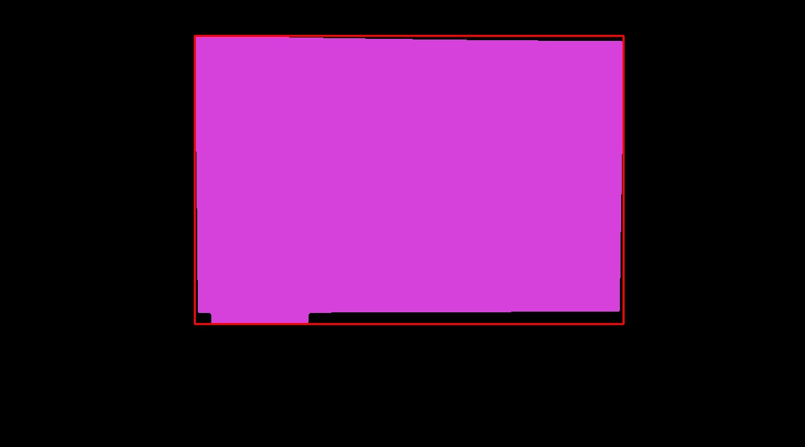
    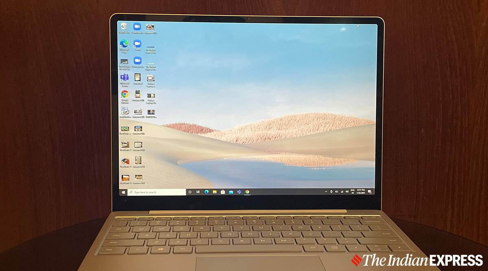

    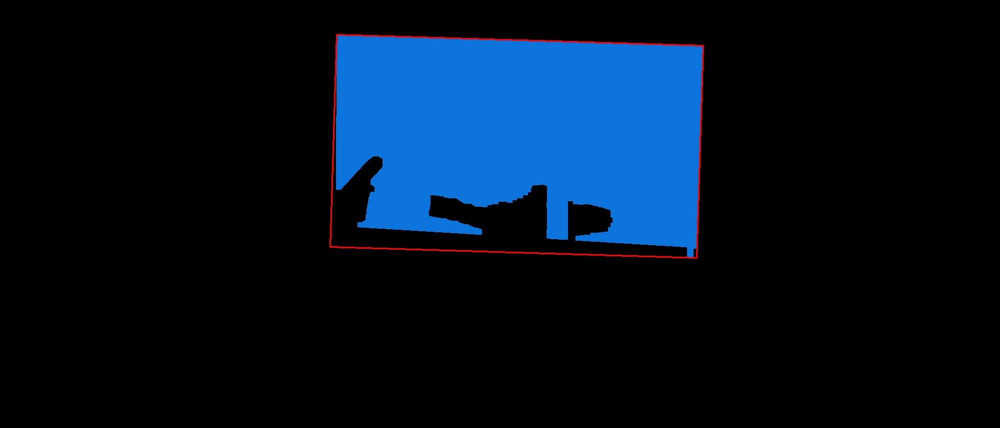
    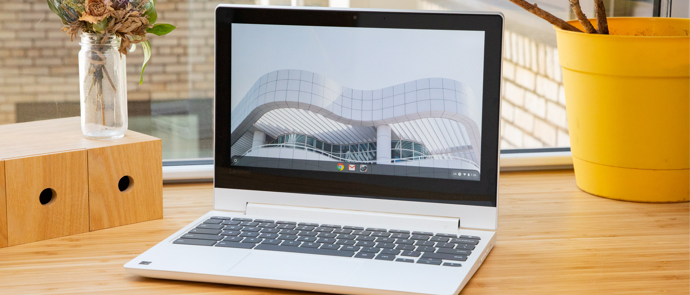

    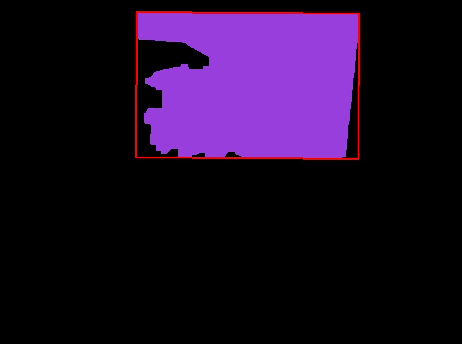
    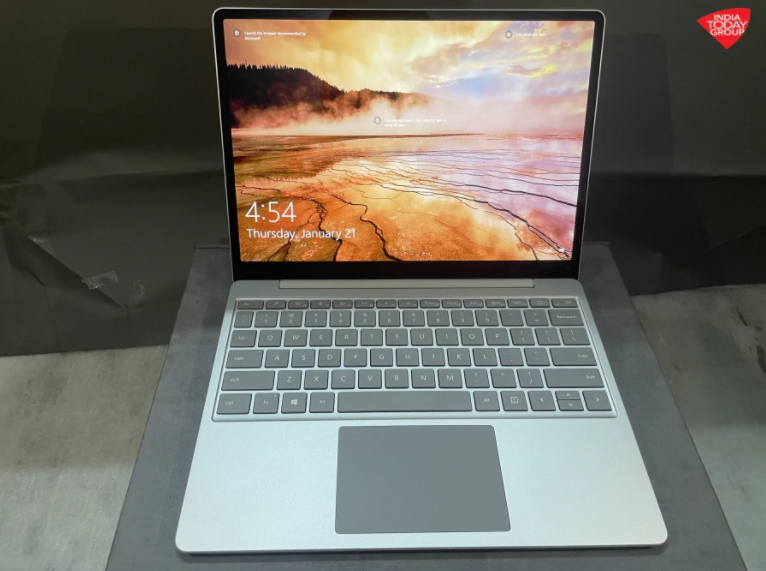

    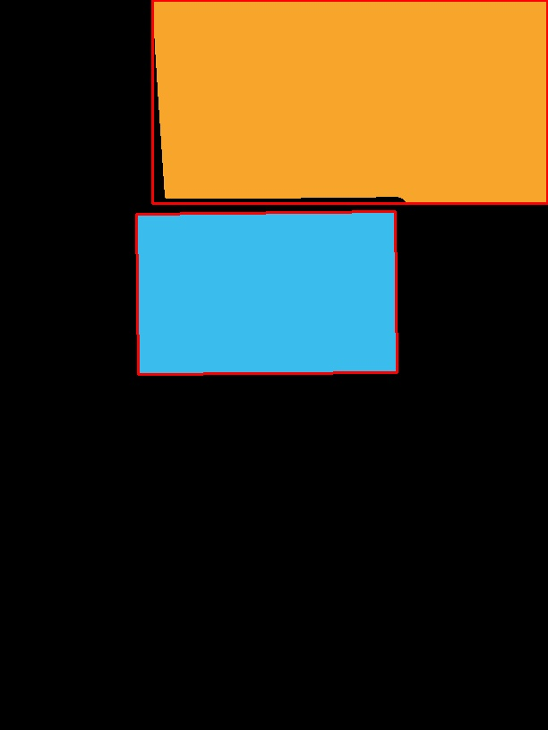
    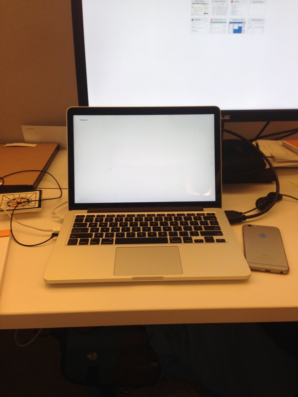

    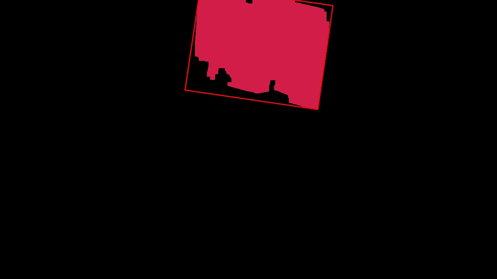
    

